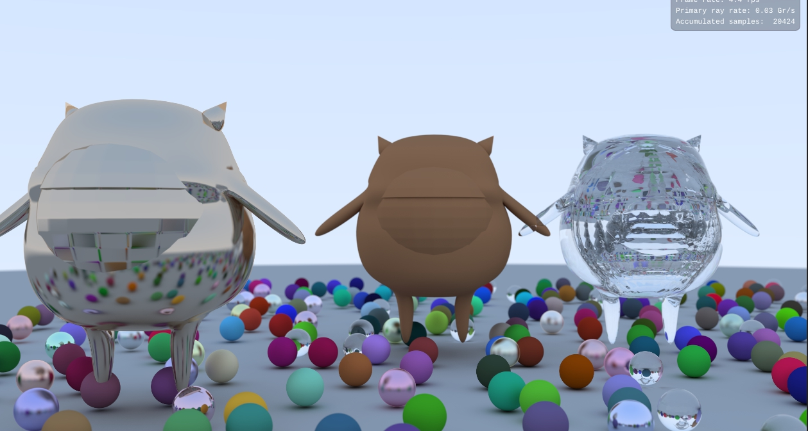
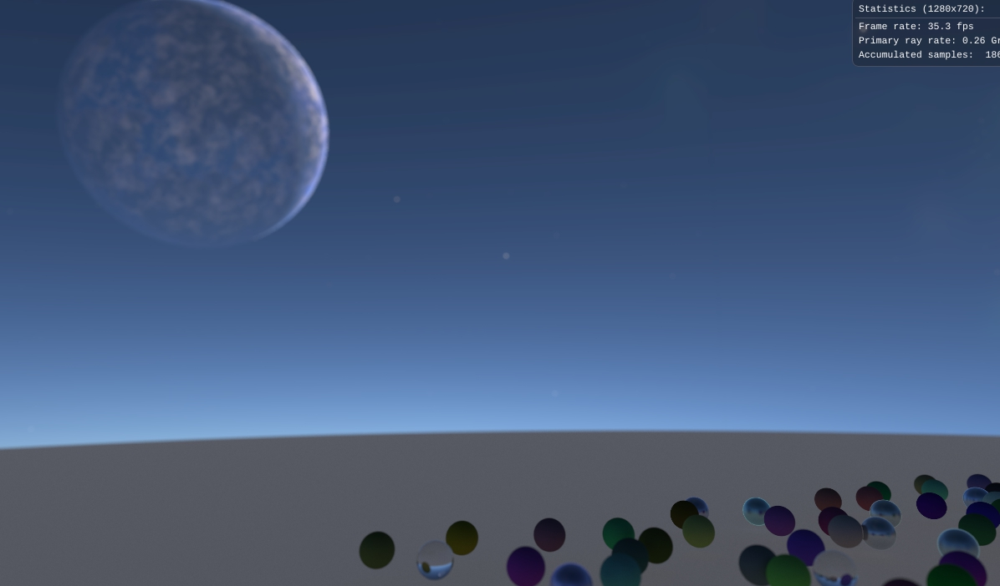
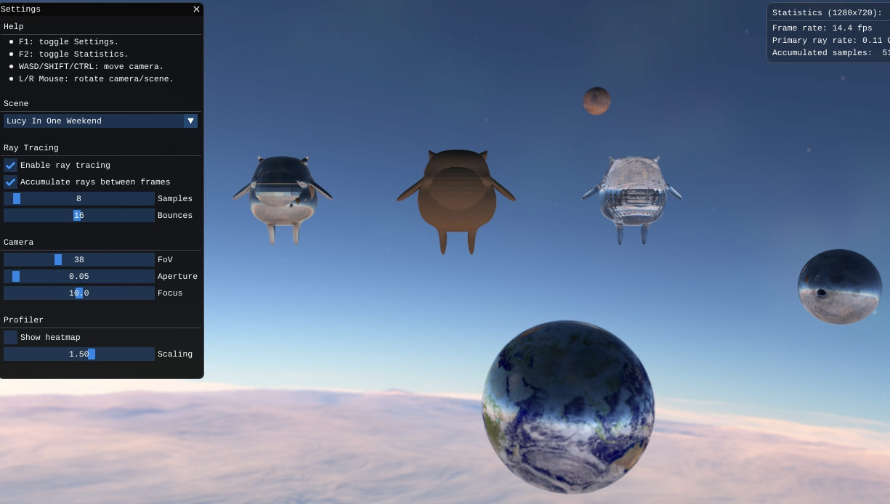

# Ray Tracing In Vulkan

## 事前準備

- 一開始花了一些時間安裝了 VULKAN 以及vcpkg, cmake ,visual studio 等開發工具

- 安裝完後要使用MSbuild的指令需要去改變電腦的環境變數

## 加入obj檔

- 試著加入在電腦動畫 用MAYA自己建出的模型

## skybox 

- 在場景中加入skybox 

## 設計場景

- 將一些模型放到自己想要的位置加上skybox嘗試設計出一個場景

## Procedure texture

- 這個部分研究一陣子 , 但還沒驗就出要怎麼在vulkan中實作出來
